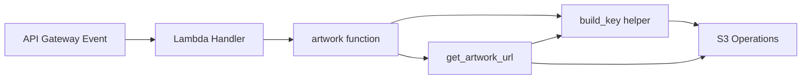

# Design Document: S3 Key Prefix

## Overview

This feature introduces a configurable `KEY_PREFIX` environment variable that gets prepended to every S3 object key in the Maxi80 backend Lambda. The three affected key patterns are:

- No-cover placeholder: `no-cover-400x400.png`
- Cover image cache: `{artist}/{track}/cover.png`
- Info JSON cache: `{artist}/{track}/info.json`

When `KEY_PREFIX` is set (e.g., `v1/`), all keys become `v1/no-cover-400x400.png`, `v1/{artist}/{track}/cover.png`, etc. When empty (the default), behavior is identical to the current implementation.

The change is minimal and localized: a single helper function builds prefixed keys, and the three call sites switch to using it. The SAM template gets a new environment variable with an empty default.

## Architecture

The architecture remains unchanged. The Lambda function continues to:

1. Receive API Gateway events
2. Check S3 for cached data (info.json)
3. Query LastFM API on cache miss
4. Store results in S3
5. Return presigned URLs for cover images

The only architectural addition is a key-construction layer that sits between the application logic and S3 key strings.



## Components and Interfaces

### Key Builder Helper

A new module-level function in `src/app.py`:

```python
def build_key(suffix: str) -> str:
    """Prepend KEY_PREFIX to an S3 key suffix."""
    prefix = os.environ.get("KEY_PREFIX", "")
    return f"{prefix}{suffix}"
```

This function is called wherever an S3 key is constructed:

| Call Site | Current Key | After Change |
|-----------|------------|--------------|
| `defaultImage()` | `no-cover-400x400.png` | `build_key("no-cover-400x400.png")` |
| `get_artwork_url()` cover key | `{artist}/{track}/cover.png` | `build_key(f"{artist}/{track}/cover.png")` |
| `artwork()` info key | `{artist}/{track}/info.json` | `build_key(f"{artist}/{track}/info.json")` |

### SAM Template Change

Add `KEY_PREFIX` to the Lambda environment variables in `template.yaml`:

```yaml
Environment:
    Variables:
        KEY_PREFIX: ""
        # ... existing vars
```

### Interface Contract

- `build_key(suffix)` accepts a bare S3 key suffix (no leading slash expected)
- Returns `KEY_PREFIX + suffix` where `KEY_PREFIX` comes from `os.environ`, defaulting to `""`
- The caller is responsible for constructing the suffix in the correct format

## Data Models

No new data models are introduced. The existing S3 object structure is preserved; only the key paths change based on the prefix value.

### S3 Key Patterns

| Key Type | Format (prefix = "") | Format (prefix = "v1/") |
|----------|---------------------|------------------------|
| No-cover image | `no-cover-400x400.png` | `v1/no-cover-400x400.png` |
| Cover image | `{artist}/{track}/cover.png` | `v1/{artist}/{track}/cover.png` |
| Info cache | `{artist}/{track}/info.json` | `v1/{artist}/{track}/info.json` |


## Correctness Properties

*A property is a characteristic or behavior that should hold true across all valid executions of a system — essentially, a formal statement about what the system should do. Properties serve as the bridge between human-readable specifications and machine-verifiable correctness guarantees.*

### Property 1: build_key concatenation

*For any* string `prefix` and *for any* string `suffix`, when `KEY_PREFIX` is set to `prefix` in the environment, `build_key(suffix)` shall return `prefix + suffix`.

This is the core correctness property. It validates that the key builder faithfully concatenates the environment prefix with the provided suffix, for all possible prefix and suffix values (including empty strings, strings with slashes, unicode, etc.).

**Validates: Requirements 1.3, 2.1, 3.1, 4.1, 5.1**

### Property 2: All key types are correctly prefixed

*For any* string `prefix`, *for any* artist name, and *for any* track name, when `KEY_PREFIX` is set to `prefix`:
- The cover image key shall equal `{prefix}{artist}/{track}/cover.png`
- The info key shall equal `{prefix}{artist}/{track}/info.json`
- The no-cover key shall equal `{prefix}no-cover-400x400.png`

This integration-level property verifies that all three key construction sites in the application pass the correct suffix to `build_key` and produce the expected full key.

**Validates: Requirements 2.1, 2.2, 2.3, 3.1, 3.2, 3.3, 4.1, 4.2, 4.3, 5.1**

## Error Handling

The `build_key` function has minimal error surface:

- **`KEY_PREFIX` not set**: `os.environ.get("KEY_PREFIX", "")` returns `""`, preserving backward compatibility. No error is raised.
- **`KEY_PREFIX` contains unexpected characters**: The function performs pure string concatenation. Any validation of the prefix value (e.g., ensuring it ends with `/`) is left to the operator. The code does not enforce a trailing slash — if the operator sets `KEY_PREFIX=v1` (no slash), keys become `v1{artist}/{track}/cover.png`, which is valid S3 but likely unintended. This is documented behavior, not an error condition.
- **Existing error paths unchanged**: All existing `ClientError`, `RequestException`, and `KeyError` handling in `app.py` remains untouched. The prefix is applied before S3 calls, so existing error handling covers prefixed keys identically.

## Testing Strategy

### Unit Tests (unittest)

Unit tests verify specific examples and integration behavior using the existing `unittest` + `unittest.mock` framework in `tests/test_handler.py`:

1. **Empty prefix backward compatibility**: With `KEY_PREFIX=""`, run the existing happy-path test and verify the response is identical to the current implementation (no prefix). This directly satisfies Requirement 6.1.
2. **Non-empty prefix key construction**: With `KEY_PREFIX="v1/"`, mock S3 and verify that `get_object`/`put_object`/`generate_presigned_url` calls use keys starting with `v1/`. Covers all three key types (Requirement 6.2, 6.3).
3. **Prefix not set in environment**: Verify that when `KEY_PREFIX` is absent from `os.environ`, `build_key` defaults to empty string.

### Property-Based Tests (Hypothesis)

Property-based tests use the [Hypothesis](https://hypothesis.readthedocs.io/) library to verify universal properties across randomly generated inputs. Each test runs a minimum of 100 iterations.

1. **Property 1 test**: Generate random `prefix` and `suffix` strings via `hypothesis.strategies.text()`. Set `KEY_PREFIX` in the environment, call `build_key(suffix)`, assert result equals `prefix + suffix`.
   - Tag: `Feature: s3-key-prefix, Property 1: build_key concatenation`

2. **Property 2 test**: Generate random `prefix`, `artist`, and `track` strings. Set `KEY_PREFIX` in the environment, call the key construction logic for all three key types, assert each equals the expected prefixed format.
   - Tag: `Feature: s3-key-prefix, Property 2: All key types are correctly prefixed`

### Test Dependencies

- `hypothesis` must be added to the test dependencies (e.g., `requirements.txt` or test extras)
- Existing test infrastructure (`unittest`, `unittest.mock`, `boto3` mocks) is reused for unit tests
